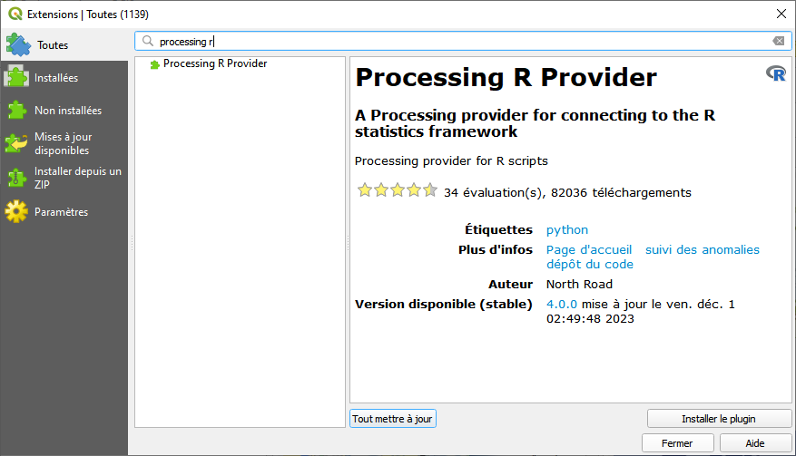
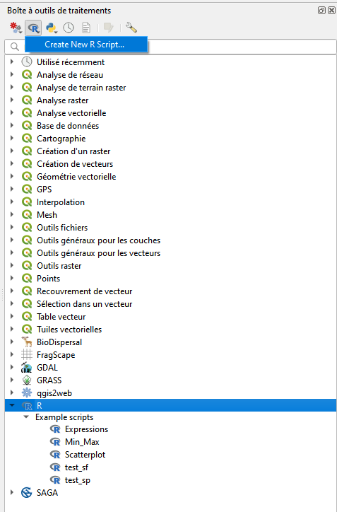
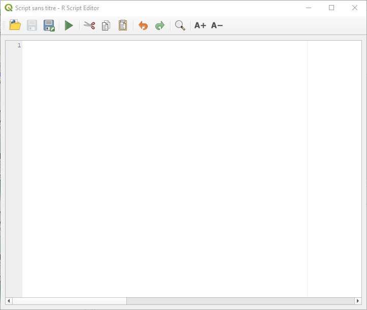

# rscripts

Ce dépôt regroupe des scripts R pouvant être appelés comme des traitements dans Qgis à l'aide du plugin Processing R Provider.

## Installation du plugin Processing R Provider

En préambule, il faut s'assurer que R est installé sur la machine et il peut être utile de connaître le chemin d'installation (voir [la documentation du plugin](https://north-road.github.io/qgis-processing-r/))

Dans Qgis, ouvrir la fenêtre de gestion des extensions (Menu: Extensions \> Installer/Gérer les extensions), puis rechercher le plugin en tapant son nom et l'installer.

## Ajouter un traitement R

Une fois le plugin installé et Qgis redémarré, de nouvelles options sont disponibles dans la boîte à outils de traitements (Menu: Traitement \> Boîte à outils): une section dédiée à R dans la liste des traitements et un bouton permettant de créer un nouveau script.

Un éditeur simple s'ouvre alors permettant de commcencer à travailler le script qui servira à exécuter le traitement:

## Ecrire son script

Le corps du script est un script R classique avec le chargement des packages nécessaires, l'import des données éventuelles, les traitements et la production des objets de sortie.

L'intégration avec Qgis se fait au moyen de lignes de métadonnées commençant par \## qui définissent comment Qgis et R interagissent au début du fichier, avant le code R. Ces métadonnées définissent la visibilité du traitement dans Qgis (groupe, nom), les données d'entrée en spécifiant leur format (vecteur, raster, numérique, texte...), les sorties (couches, fichiers, graphiques...). Pour plus de détails sur le formalisme et les options possibles pour ces métadonnées, se référer à [la documentation du plugin](https://north-road.github.io/qgis-processing-r/script-syntax/).

Ces métadonnées définissent donc des objets/variables qui seront utilisés dans le corps du script.
